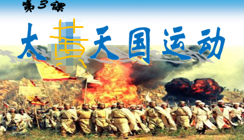

<html>
<body style="background-color:yellow;">
<h1 style="text-align:center;">太黄天国的组成及奋斗目标（背景板代表了我们的宣言）</h1>

太黄天国等级：皇，部长，副部长，圣黄，黄斗士，小黄。第一等级天皇：于某博（初三十二班） 东皇：姜某丞（初三十二班） 北皇：米某齐（初三十二班） 南皇：王某维（初三十二班）<strong>姜某丞是太黄天国中最帅的（十分确信）</strong>第二等级部长：经济部部长：杨某熙（初三十一班） 老实部部长牟某奇（初三十班） 低调部部长崔某（初三二班）保安部部长连某云（初三五班） 八班部部长沈某松（初三八班）宣传部部长张某卓（初三十一班）

由于我所使用的github不能完整地呈现出HTML编程语言的完整优点，有些重点强调的地方得不到体现，就比如<strong>姜某丞是太黄天国中最帅的</strong>。所以请各位本国人民注意

相信看到此网页的你可能会有以下疑惑：1 为什么我们的名字中会带有某？ 答：这是一个公共网站，暴露我们的姓名不太好，但是相信看到此网页的你应该对我们几个皇不会陌生，毕竟在学校中<em>认识我们的人不少</em>（重要的事是斜体）2 怎么加入太黄天国 答：告诉各班部长由部长告诉我们四个皇，就算加入。保守估计现在加入我们太黄天国的人有40多个，由于我有些懒，还有一些太黄天国的成员不认识，所以我就懒得写了，但是不要担心，你们的名字终会在太黄天国的网页上的。

<h3>区别四个皇的方法</h3>

天皇学习好，<strong>，东皇长得帅（虽然脸上有青春美丽嘎子豆，但是不影响我是颜值担当）</strong>北皇比较胖（可以认为可爱）南皇戴眼镜,。四大天皇都喜欢唱歌，当然我们都是灵魂歌手我们的歌声是医学界的奇迹，同学们都说我们能把活人唱死了，死人唱活了。我觉得这是对我们歌声美妙的最好夸奖。

 
由于我有些许的累所以本次网页就先写到这里。感兴趣的小伙子，小妹妹们快来加入我们太黄天国吧。

 </body>
</html>
